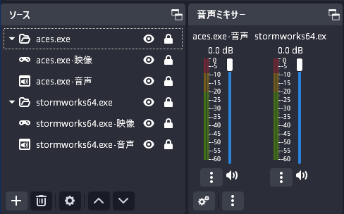

# OBSAutoReplayBuffer

指定したアプリケーションの起動、停止に合わせて[OBS Studio](https://github.com/obsproject/obs-studio)のリプレイバッファを開始、終了するアプリケーションです。

GeForce Experienceのインスタントリプレイの代わりにOBSのリプレイバッファを用いる場合、スタートアップに`obs64.exe --startreplaybuffer --minimize-to-tray`を登録する方法が主流ですが、この方法では録画対象のウィンドウがないときにもエンコード、記録が行われてしまい、余計な負荷がかかります(「真っ黒な画面」のエンコード負荷はなぜかゲーム画面のそれより倍以上に高い)。OBSAutoReplayBufferは「必要な時だけリプレイバッファ」を実現します。

リプレイバッファの開始、終了、記録を確認するために、[OBSNotification](https://gist.github.com/OER1057/86fe13dc46704fd940ac14ebd5ceaf95#file-obsnotification-md)を組み合わせて使用するとよいでしょう。

## 機能

実行時にOBSが起動していない場合は起動します。

指定したプロセスのうち1つが起動すると、リプレイバッファを開始します。OBSが起動していない場合は起動します。

指定したプロセスが1つも起動していない状態になると、リプレイバッファを停止します。OBSは起動したままです。

## 使用法

### OBSの設定

対象のウィンドウがいい感じに録画されるように設定してください。以下は一例です。また、リプレイバッファとかショートカットキーとかもいい感じに設定してください。GeForce Exprienceのキーと被っていると正常に設定できないのでご注意ください(1敗)。



### obs-websocket有効化

WebSocket経由でOBSの操作を行うので、obs-websocketを有効にしてください。標準で搭載されています。

### ランタイムのインストール

[Microsoft .NET Runtime 7.0](https://dotnet.microsoft.com/ja-jp/download/dotnet/7.0)がインストールされていない場合はインストールしてください。

`winget list --id Microsoft.DotNet`を実行し、`Microsoft.DotNet.Runtime.7`または`Microsoft.DotNet.DesktopRuntime.7`があればインストール済みです。

`winget install Microsoft.DotNet.Runtime.7`でインストールできます。

### コマンド

コマンドラインで設定を指定します。batファイルを用意するか、後述のようにスタートアップ登録しておくとよいでしょう。

```
OBSAutoReplayBuffer.exe <引数> [--オプション 引数]
```

- `プロセス名`(オプションなし) : 連動させるアプリケーションのプロセス名を指定する。半角スペース区切りで複数指定可。

実行ファイル名と違うのかどうかよく分かりませんが、PowerShellを用いて以下のようにウィンドウタイトルからプロセス名を取得できます。

```powershell
PS > Get-Process | Where-Object {$_.MainWindowTitle -like "*War Thunder*"} | Select-Object ProcessName,MainWindowTitle

ProcessName MainWindowTitle
----------- ---------------
aces        War Thunder
```

- `--obs ファイルパス` : OBSの実行ファイルのパスを指定する。既定値は`C:\Program Files\obs-studio\bin\64bit\obs64.exe`。
- `--port ポート番号` : obs-websocketのサーバーポートを指定する。既定値は`4455`。
- `--password パスワード` : obs-websocketのサーバーパスワードを指定する。既定値は認証なし。

通常はパスワード以外設定する必要はありません。

### スタートアップ登録

目的の設定で正しく動作することを確認したら、以下の手順でログインと同時に実行するようにします。一瞬だけウィンドウが表示されますが、バックグラウンドで動作します。

1. `ファイル名を指定して実行`かエクスプローラのアドレスバーに`shell:startup`と入力し、スタートアップフォルダを開く。
2. すでにOBSのスタートアップ登録がされている場合は削除する。
3. 右クリック→新規作成→ショートカット
4. 項目の場所に`powershell.exe -Command "Start-Process -WindowStyle Hidden 'OBSAutoReplayBuffer.exeの絶対パス' '<プロセス名> [設定]'"`を入力し進める。

UIがないので、終了するにはタスクマネージャで探し出して終了するなり`taskkill /im obsautoreplaybuffer.exe /f`するなりしてください。

## 注意点

### 免責事項

作者の手元で動くことのみを目的に作っているので、自己責任でご利用ください。実は動作していなくて肝心なシーンを録り損ねたなど言われても責任は負いかねます。

### 既知の不具合

[Issues](https://github.com/OER1057/OBSAutoReplayBuffer/issues)参照